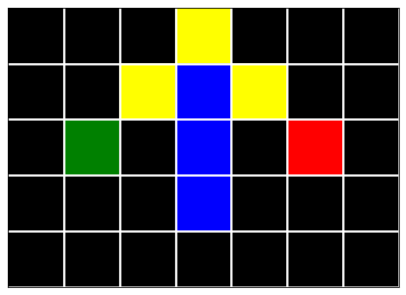

# Python A-Star (A*) 
A basic A* implementation with python and jupyter notebooks using the euclidean distance.

Check [the notebook](/notebook.ipynb) to see the full example.

## Sample
The starting point is green, the end is in red. Obstacles are colored blue. The resulting path between start and end is yellow.

### Initial Maze
```
initial_maze = np.array([
    [0, 0, 0, 0, 0, 0, 0],
    [0, 0, 0, 3, 0, 0, 0],
    [0, 1, 0, 3, 0, 2, 0],
    [0, 0, 0, 3, 0, 0, 0],
    [0, 0, 0, 0, 0, 0, 0]
])
```


### Resulting Path


## Sources
* https://csis.pace.edu/~benjamin/teaching/cs627/webfiles/Astar.pdf
* https://www.redblobgames.com/pathfinding/a-star/implementation.html